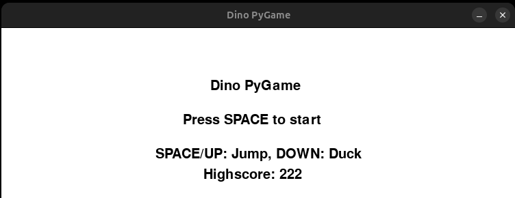
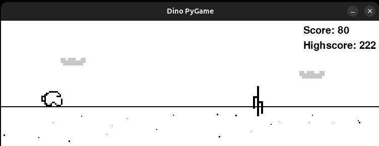
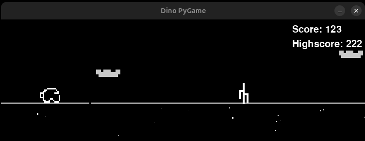
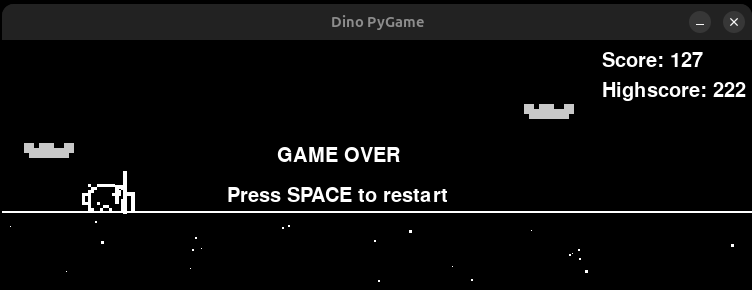

# Dino-PyGame

Dino PyGame es una recreación minimalista y del juego del dinosaurio de Chrome, desarrollado en Python utilizando la librería Pygame y NumPy. Este proyecto destaca por su enfoque en la generación procedural de activos, desde el arte hasta el audio, creando una experiencia de juego de estilo retro. El juego desafía al jugador a saltar y agacharse para esquivar obstáculos mientras la velocidad aumenta progresivamente. La clasica característica de alternancia dinámica entre el modo día y noche cada 100 puntos esta habilitada, lo que invierte la paleta de colores para modificar la ambientación visual.

---

  

  

  

  

---

## Características principales

* Dinosaurio con animaciones: correr, agacharse, saltar y estado "muerto", todas definidas por arrays de pixel-art en el código.
* Obstáculos generados proceduralmente: distintos tipos de cactus (con/ sin brazos) y aves con animación por frames.
* Alternancia día / noche cada 100 puntos para cambiar la paleta de colores y la ambientación.
* Efectos de sonido sintetizados en tiempo real (tonos y ruido) usando NumPy + Pygame — no se requieren ficheros de audio externos.
* Registro de puntuación y récord persistente en `Highscore.json` (ej.: `{"highscore": 222}`).

---

## Requisitos

* Python 3.8+ (3.10/3.11 recomendados)
* pip
* Dependencias principales: `pygame`, `numpy`

---

## Controles

* `SPACE` / `UP` / `W` — Saltar / iniciar el juego
* `DOWN` / `S` — Agacharse
* Cerrar la ventana — Salir del juego

---

## Archivos importantes

* `Game.py` — Código fuente principal (lógica del juego, sprites programáticos, sonidos procedurales, guardado del highscore, etc.).
* `Highscore.json` — Archivo JSON que almacena el récord; puede eliminarse o editarse para reiniciar el highscore.
* `Imagenes/*` — Carpeta sugerida para capturas y miniaturas (utilizadas en este README).

---

## Estructura/Arquitectura

* Clases principales en `Game.py`: `Dinosaur`, `Obstacle`, `Ground`, `Cloud` y `Game`.
* El juego utiliza grupos de sprites de Pygame y un bucle principal (game loop) para actualizar la lógica y renderizar la escena.

---

## 📝 Licencia

Este proyecto está licenciado bajo la [Licencia GNU](LICENSE).

---
